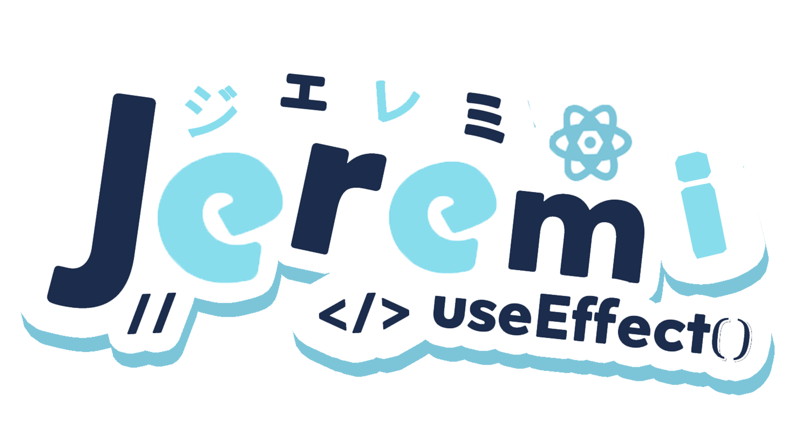

## I'm Jeremi Herodian Abednigo

  

  
Hello World👋 I'am a full stack developer and I also have an interest in the world of Artificial Intelligence. I
    really like
    learning new things and developing them into something useful for many people.

  

  
Want to know more about me? Check my complete profile here:

  

### My Contact

  
  
  
  
  
  

